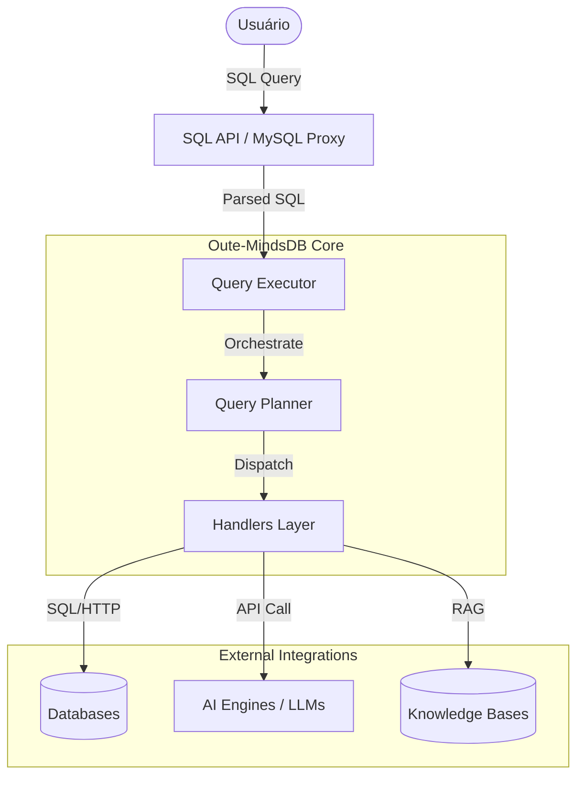

# 🧠 Oute-MindsDB: Technical DeepDive & Repository Wiki

Este documento é um mergulho profundo (DeepWiki) na arquitetura e funcionamento do projeto, similar ao que ferramentas como Devin.ai geram para repositórios complexos.

---

## 🏗 Arquitetura do Sistema

O Oute-MindsDB opera como uma camada de abstração (Proxy SQL) entre o usuário e as diversas fontes de dados e inteligência. 

### Visão Geral da Arquitetura



### Componentes Principais

1. **SQL API & MySQL Proxy**: O ponto de entrada principal. O MindsDB expõe uma interface que aceita conexões via protocolo MySQL/PostgreSQL, permitindo usar clientes de BI (DBeaver, Tableau) para interagir com IA.
2. **Query Planner**: Atua como o "compilador" do SQL. Ele identifica se uma consulta deve ir para um banco de dados tradicional (ex: `SELECT * FROM users`) ou para um modelo de IA (ex: `SELECT * FROM predictor_model WHERE input='...'`).
3. **Handlers Layer**:
    - **Data Handlers**: Localizados em `mindsdb/integrations/handlers`. Cada pasta representa um conector para um banco específico (Redis, Postgres, Airtable, etc).
    - **ML Handlers**: Motores que trazem modelos de IA. Incluem integrações com OpenAI, Groq, Hugging Face, Anthropic, LangChain.
4. **Knowledge Base (KB)**: Sistema interno para gerenciar dados vetorizados. Facilita o RAG fornecendo busca semântica em documentos e logs.

---

## 🚨 Dica Arquitetural Crítica: Contornando Bugs da Camada "Agent" com Groq/Gemini

O conceito de **Agents** no Oute-MindsDB permite automação visual. Contudo, em versões recentes, o uso de `CREATE AGENT` com modelos de alto desempenho (como o **Groq Llama 3** ou **Gemini 1.5 Flash**) pode gerar bugs (ex: Erros de Pydantic devido ao parâmetro extra `"service_tier": "on_demand"` ou modelo desconhecido).

### O "Caminho Hacker" / Abordagem Estável via SQL Puro

O verdadeiro poder do MindsDB não exige a interface gráfica de Agente. Ele consiste em tratar a IA como uma Tabela de Banco de Dados comum (AI Tables) através de `JOIN`. A criação de Modelos `CREATE MODEL` não sofre das mesmas limitações que a camada de agentes.

#### Fluxo Correto e Estável (Exemplo com Groq):

1. **Criar Motor Groq:**
```sql
CREATE ML_ENGINE groq_engine 
FROM groq 
USING groq_api_key='SUA_CHAVE_AQUI';
```

2. **Criar Modelo de IA (com Prompt Declarativo):**
```sql
CREATE MODEL mindsdb.bot_oute 
PREDICT response 
USING engine='groq_engine', 
      model_name='llama-3.3-70b-versatile', 
      prompt_template='Você é o analista de dados da Oute. Responda a pergunta: {{question}}, com base no seguinte registro do banco de dados: {{conteudo}}';
```

3. **Interagir e Cruzar Dados Tabela x IA:**
```sql
SELECT ia.response 
FROM mindsdb.bot_oute AS ia 
JOIN mindsdb_pg_conn.lista_documentos AS doc 
ON 1=1 
WHERE ia.question = 'Qual a natureza deste documento?';
```
Esta abordagem contorna falhas na interface LangChain injetada dentro dos Agentes de MindsDB, conferindo performance máxima no Groq e robustez irrestrita.

---

## 📂 Guia do Repositório (File Structure Explorer)

| Diretório/Arquivo | Descrição |
| :--- | :--- |
| `mindsdb/api` | Implementações dos servidores HTTP, MySQL Proxy e interface MCP. |
| `mindsdb/integrations/handlers` | Onde a mágica da conectividade acontece. Adicione novos bancos ou modelos aqui. |
| `mindsdb/interfaces` | Abstrações para bancos de dados internos e sistema de arquivos. |
| `mindsdb/utilities` | Ferramentas de log, renderização de SQL e helpers comuns. |
| `docs/` | Documentação exaustiva com exemplos mdx, e tutoriais como este. |
| `docker-compose.yml` | Configuração ideal para rodar o ambiente completo com RabbitMQ, Redis, etc. |

---

## ⚙️ Configuração para Desenvolvedores

### 🧰 Requisitos
- Python 3.10+
- Docker (opcional, mas recomendado)

### 🧩 Como adicionar um novo Handler
Para estender o Oute-MindsDB:
1. Crie uma nova pasta em `mindsdb/integrations/handlers/nome_do_handler`.
2. Implemente o `handler.py` herdando de `mindsdb.integrations.libs.base.DatabaseHandler` ou `MLHandler`.
3. Registre o handler no arquivo `__init__.py` da pasta.
